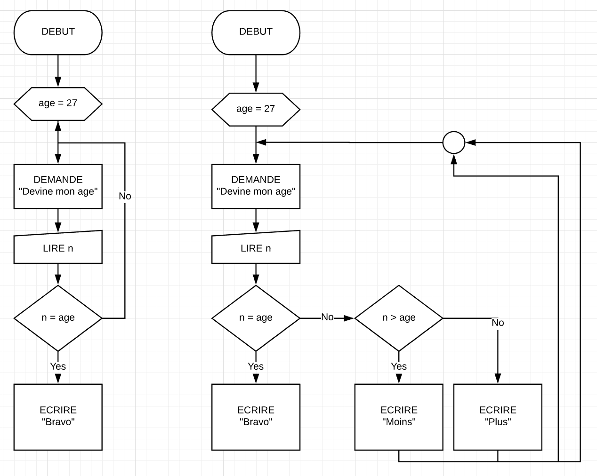

## isHot

### Subject
Print if water is boiling

### Pseudo code
```
Variables
  temperature

DEBUT
  Lire temperature
  SI temperature >= 100 ALORS
    ECRIRE "Ca bout"
  SINON
    ECRIRE "Ca bout pas encore.."
FIN
```

### Chart


### JavaScript
```javascript
var temperature = prompt("Water temperature?")

if temperature <= 100 {
  console.log("It\'s Hot!")
} else {
  console.log("It\'s not ready..")
}
```

With a function
```javascript

/* ES5 */
function isHot(temperature) {
  if temperature >= 100 {
    return true
  } else {
    return false
  }
}

// simplified
function isHot(temperature) {
  return temperature >= 100
}


/* ES6 */
const isHot = temperature => temperature >= 100
```

## MinMax

### Subject
Ask user to guess a number (integer) generated between 0 and 100, print:
- "Bingo" if user answer is correct
- "It's less" if user answer if above number
- "It's more" if below

### Pseudo code
```
Variables
  age <- 45 (ou RANDOM[0, 100])
  nombre

DEBUT
  TANT QUE nombre != age ALORS
    DEMANDE "Devine mon age:"
    LIRE nombre
    SI nombre > age ALORS
      ECRIRE "Moins"
    SINON
      ECRIRE "Plus"
  FIN TANT QUE
  ECRIRE "Bravo!"
FIN
```

### Chart



### JavaScript

```javascript
var age = Math.floor(Math.random() * 100)

while (1) {
  let response = prompt("response: ")
  
  if (response == age) {
    alert("Bingo")
    break
  } else if (response > age) {
    alert("It's less")
  } else {
    alert("It's more")
  }
}
```
